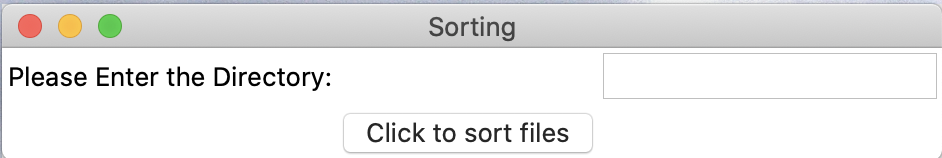
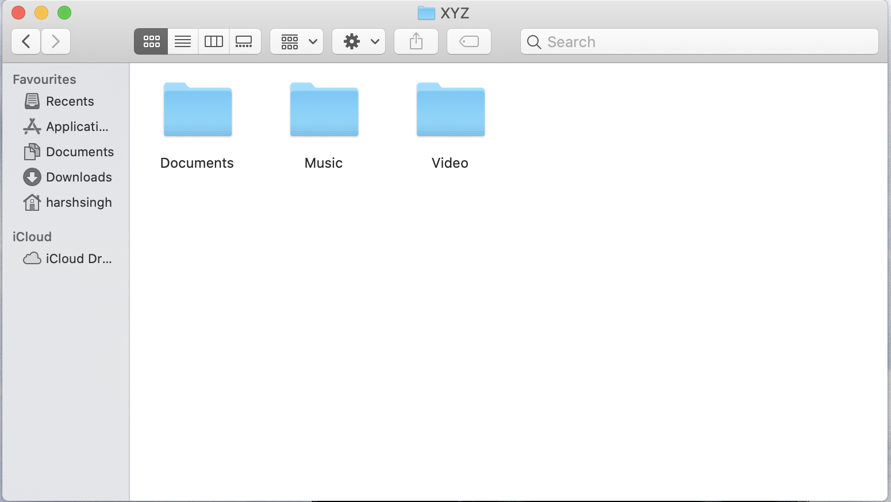

# Text-Bunch


This python script will sort all the files present in a folder based on their extension.


## Installation
No extra installation is required expect Python


After installed required package, you can use it by
`python sort-files.py`


### How to run python script? 
#### Step 1.
After installing all the dependencies run sort-files.py
#### Step 2.
The GUI window will open and enter the directory address you would like to sort.
#### Step 3.
Click on sort button and all files would be sorted.


## App-Format


## Folder Before


## Folder After


## Dependencies
```text
Python
TKinter
Shell Utilities (shutil)
```


